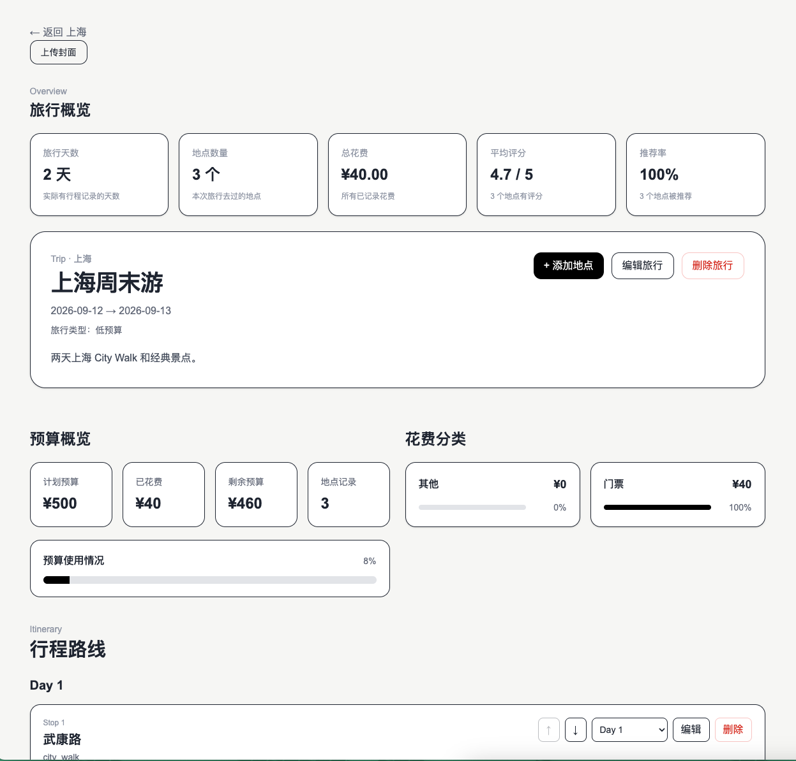
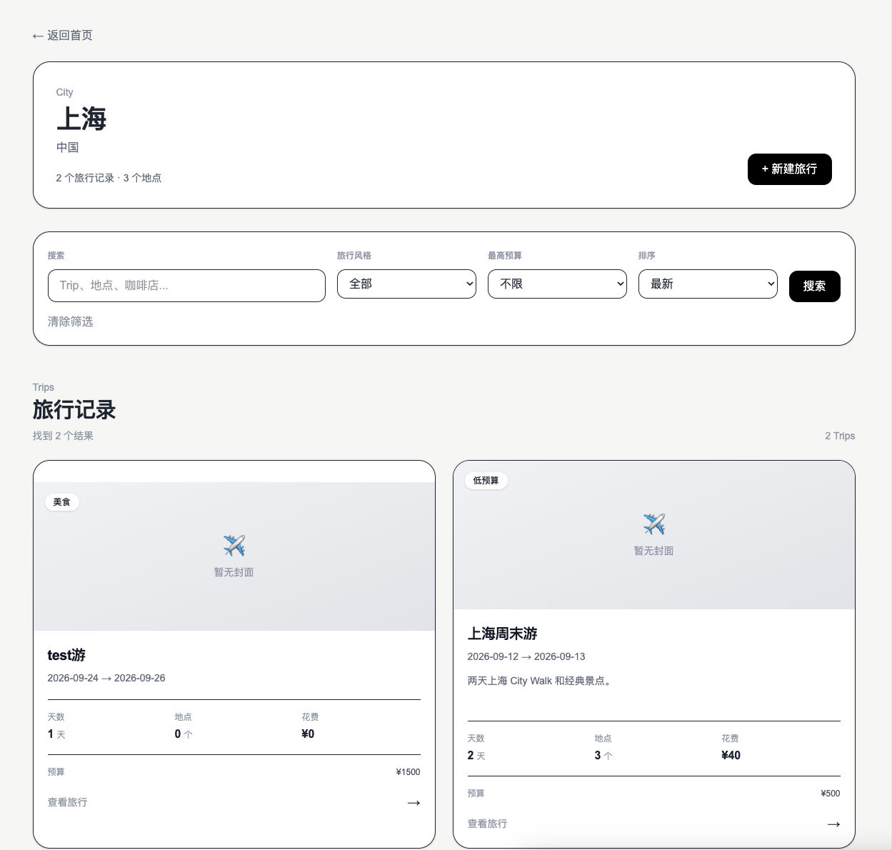
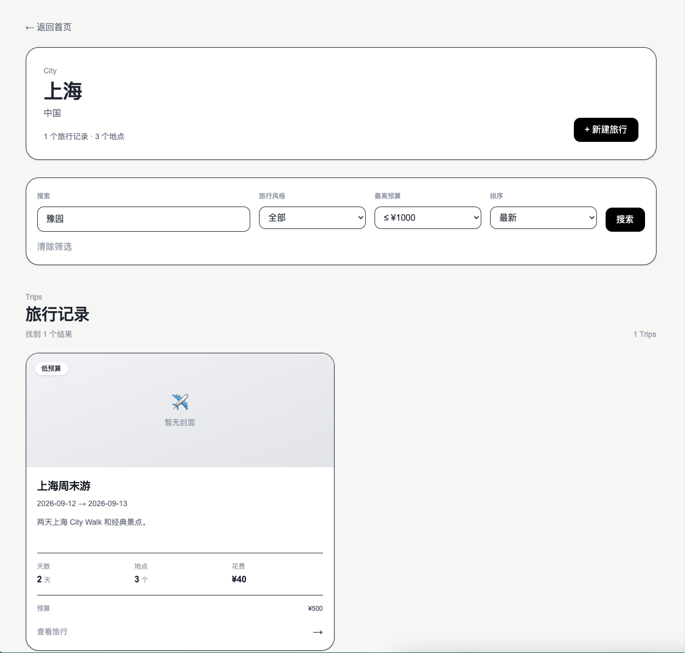

# Travel Log

Travel Log is a full-stack travel record and itinerary management application for organizing real-world trips into structured, searchable, and visual travel data.

Instead of keeping travel experiences in long-form notes, users can organize trips by city and day, record places they visited, track expenses and ratings, reorder itinerary stops, and review trip-level statistics.

## Live Demo

**Frontend:** `https://travel-log-aytx.vercel.app`  
**Backend API:** `https://travel-log-ym0g.onrender.com`  
**API Documentation:** `https://travel-log-ym0g.onrender.com/docs`  

> The backend is hosted on a free-tier service and may require a short cold start after a period of inactivity.

## Screenshots

### Trip Planning



### Trip Analytics



### Search and Discovery



## Core Features

* Organize travel records by city, trip, day, and place
* Create, update, and delete trips and visits
* Reorder itinerary stops within the same day
* Move visits across different travel days
* Search trips by trip or place information
* Filter trips by travel style and budget
* Sort trips by date, cost, and rating
* Track trip budgets and actual expenses
* Generate expense-category breakdowns
* Calculate trip statistics including total cost, average rating, and recommendation rate
* Search real-world places and display geographic locations on an interactive map
* Upload and display trip and visit images

## Architecture

```text
                         ┌─────────────────────┐
                         │       Browser       │
                         └──────────┬──────────┘
                                    │
                                    ▼
                         ┌─────────────────────┐
                         │       Next.js       │
                         │      TypeScript     │
                         │       Vercel        │
                         └──────────┬──────────┘
                                    │
                         REST / JSON│
                                    ▼
                         ┌─────────────────────┐
                         │       FastAPI       │
                         │       Render        │
                         └──────────┬──────────┘
                                    │
                              SQLAlchemy
                                    │
                                    ▼
                         ┌─────────────────────┐
                         │     PostgreSQL      │
                         └─────────────────────┘
```

Initial page data is fetched through Next.js Server Components, while interactive mutations are sent directly from Client Components to the FastAPI API.

After successful mutations, the client updates local state immediately and refreshes the server-rendered data to reconcile it with the backend.

## Tech Stack

### Backend

* Python
* FastAPI
* SQLAlchemy
* PostgreSQL
* Alembic
* Pydantic
* pytest

### Frontend

* Next.js
* React
* TypeScript

### Infrastructure

* Render — FastAPI and PostgreSQL
* Vercel — Next.js
* GitHub — source control and deployment integration

## Backend Design

The backend is modeled around four primary domain objects:

```text
City
 ├── Place
 │
 └── Trip
      │
      └── Visit ────── Place
```

A `Trip` represents a complete travel experience in one city.

A `Place` represents a reusable geographic location.

A `Visit` connects a place to a specific trip and stores trip-specific information such as:

* day number
* itinerary order
* cost
* expense category
* rating
* notes
* recommendation
* visit duration
* photo

Separating `Place` from `Visit` allows the same real-world location to be reused across multiple trips without duplicating geographic data.

## Itinerary Ordering

Visits contain both:

```text
day_number
order_index
```

This allows the backend to represent itineraries such as:

```text
Day 1
  1. Wukang Road
  2. The Bund

Day 2
  1. Yu Garden
```

The API supports both same-day reordering and moving visits between different days while maintaining itinerary ordering.

## Search and Analytics

Trip search is handled by the backend rather than filtering already-loaded frontend data.

Search supports:

* text queries
* place matching
* travel-style filtering
* maximum planned budget
* cost/rating/date sorting

The backend also performs SQL-based aggregation for trip analytics, including:

* total expenses
* remaining budget
* expense breakdown by category
* number of travel days
* number of visited places
* average rating
* recommendation rate

## Database Migrations

Database schema changes are managed using Alembic rather than creating tables automatically during application startup.

Production deployments execute:

```bash
alembic upgrade head
```

before starting the latest application version.

This keeps database schema evolution explicit and reproducible across development, testing, and production environments.

## Testing

Backend integration tests use:

* pytest
* FastAPI TestClient
* an isolated PostgreSQL test database

Tests cover major application workflows including:

* health checks
* trip CRUD
* visit CRUD
* itinerary reordering
* cross-day visit movement
* trip summaries
* expense breakdowns
* trip analytics
* search behavior
* error handling

The test environment is isolated from the development database to prevent test data from affecting local application data.

Run the backend test suite with:

```bash
cd backend
pytest -v
```

## Local Development

### Backend

Create a virtual environment:

```bash
cd backend
python3 -m venv .venv
source .venv/bin/activate
pip install -r requirements.txt
```

Create a `.env` file based on:

```text
backend/.env.example
```

Apply database migrations:

```bash
alembic upgrade head
```

Start FastAPI:

```bash
uvicorn app.main:app --reload
```

The API will be available at:

```text
http://127.0.0.1:8000
```

Swagger documentation:

```text
http://127.0.0.1:8000/docs
```

### Frontend

```bash
cd frontend
npm install
npm run dev
```

Create:

```text
frontend/.env.local
```

based on:

```text
frontend/.env.example
```

The frontend will be available at:

```text
http://localhost:3000
```

## Production Deployment

The application is deployed as separate frontend, backend, and database services:

```text
Vercel
   │
   │ HTTPS
   ▼
Render FastAPI
   │
   ▼
PostgreSQL
```

Environment-specific configuration is provided through environment variables rather than hard-coded credentials or service URLs.

The backend exposes liveness and readiness endpoints for deployment monitoring:

```text
GET /health/live
GET /health/ready
```

## Project Structure

```text
travel-log-project/
├── backend/
│   ├── alembic/
│   ├── app/
│   ├── tests/
│   ├── alembic.ini
│   └── requirements.txt
│
├── frontend/
│   ├── app/
│   ├── components/
│   ├── lib/
│   └── types/
│
└── README.md
```
